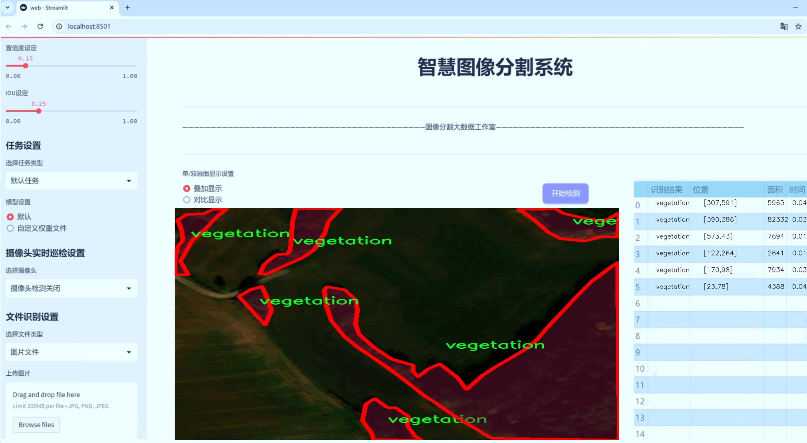
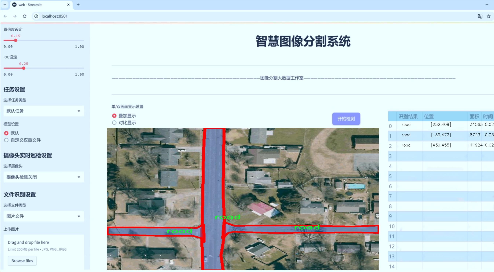
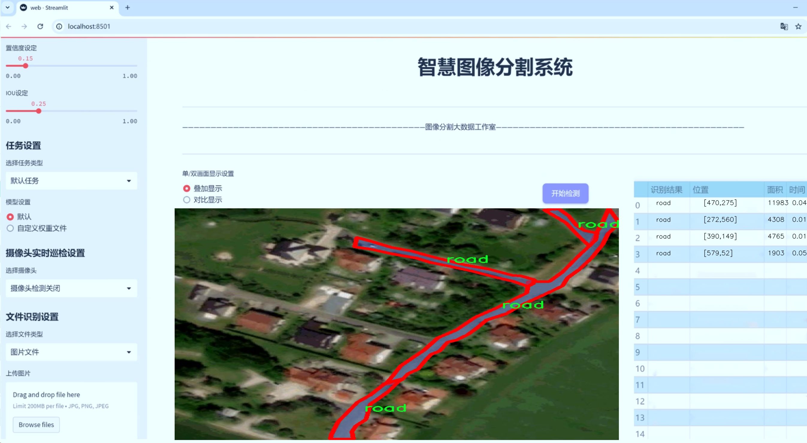
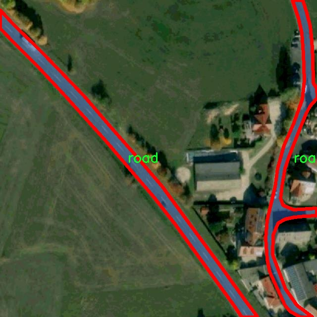
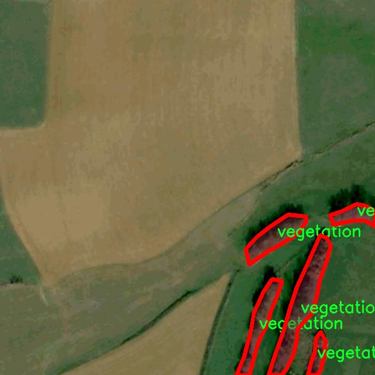
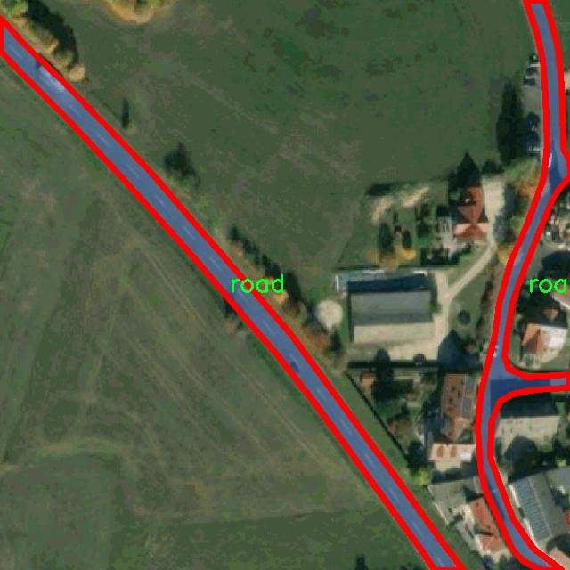
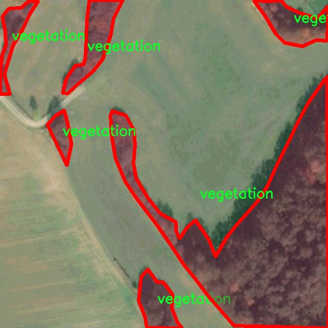
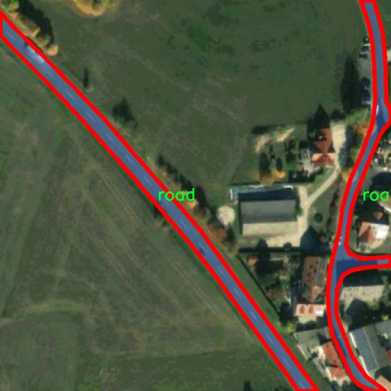

# 遥感图建筑植被道路图像分割系统源码＆数据集分享
 [yolov8-seg-swintransformer＆yolov8-seg-C2f-EMSC等50+全套改进创新点发刊_一键训练教程_Web前端展示]

### 1.研究背景与意义

项目参考[ILSVRC ImageNet Large Scale Visual Recognition Challenge](https://gitee.com/YOLOv8_YOLOv11_Segmentation_Studio/projects)

项目来源[AAAI Global Al lnnovation Contest](https://kdocs.cn/l/cszuIiCKVNis)

研究背景与意义

随着遥感技术的迅速发展，遥感图像的获取和处理能力显著提升，为城市规划、环境监测和资源管理等领域提供了强有力的支持。建筑、植被和道路作为城市和乡村环境中的重要组成部分，其准确的识别与分割对于实现智能城市建设、生态环境保护和交通管理等具有重要意义。传统的图像处理方法在面对复杂的地物特征时，往往难以实现高效、准确的分割。因此，基于深度学习的图像分割技术逐渐成为研究的热点，其中YOLO（You Only Look Once）系列模型因其高效性和实时性而受到广泛关注。

YOLOv8作为YOLO系列的最新版本，结合了更为先进的卷积神经网络架构和优化算法，具备了更强的特征提取能力和更快的处理速度。然而，针对遥感图像中建筑、植被和道路的分割任务，YOLOv8仍存在一定的局限性，尤其是在复杂场景下的实例分割精度和细节捕捉能力。因此，针对YOLOv8进行改进，以适应遥感图像的特征，显得尤为重要。

本研究的意义在于，通过改进YOLOv8模型，构建一个高效的遥感图像分割系统，以实现对建筑、植被和道路的精准识别与分割。我们将使用包含1500幅图像的“aerial-segmentation-3”数据集，该数据集涵盖了建筑、道路和植被三大类，提供了丰富的训练样本。这一数据集的多样性和代表性为模型的训练和验证提供了良好的基础，使得改进后的YOLOv8模型能够在不同场景下表现出色。

在研究过程中，我们将探索如何通过数据增强、特征融合和损失函数优化等技术手段，提升模型在遥感图像分割任务中的表现。通过对建筑、植被和道路的精确分割，不仅可以为城市规划提供科学依据，还可以为环境监测提供数据支持，助力可持续发展目标的实现。此外，改进后的模型还可广泛应用于无人驾驶、灾害监测和土地利用变化分析等领域，具有重要的实际应用价值。

综上所述，本研究旨在通过改进YOLOv8模型，构建一个高效的遥感图像分割系统，以实现对建筑、植被和道路的精准识别与分割。这不仅为遥感图像处理领域提供了新的思路和方法，也为相关应用领域的研究和实践提供了有力支持。通过本研究的开展，我们希望能够推动遥感技术与深度学习的结合，为智能城市和可持续发展贡献一份力量。

### 2.图片演示







##### 注意：由于此博客编辑较早，上面“2.图片演示”和“3.视频演示”展示的系统图片或者视频可能为老版本，新版本在老版本的基础上升级如下：（实际效果以升级的新版本为准）

  （1）适配了YOLOV8的“目标检测”模型和“实例分割”模型，通过加载相应的权重（.pt）文件即可自适应加载模型。

  （2）支持“图片识别”、“视频识别”、“摄像头实时识别”三种识别模式。

  （3）支持“图片识别”、“视频识别”、“摄像头实时识别”三种识别结果保存导出，解决手动导出（容易卡顿出现爆内存）存在的问题，识别完自动保存结果并导出到tempDir中。

  （4）支持Web前端系统中的标题、背景图等自定义修改，后面提供修改教程。

  另外本项目提供训练的数据集和训练教程,暂不提供权重文件（best.pt）,需要您按照教程进行训练后实现图片演示和Web前端界面演示的效果。

### 3.视频演示

[3.1 视频演示](https://www.bilibili.com/video/BV16P1hY6EDP/)

### 4.数据集信息展示

##### 4.1 本项目数据集详细数据（类别数＆类别名）

nc: 3
names: ['building', 'road', 'vegetation']


##### 4.2 本项目数据集信息介绍

数据集信息展示

在遥感图像分割领域，数据集的质量和多样性对模型的训练效果至关重要。本研究采用的数据集名为“aerial-segmentation-3”，专门用于训练和改进YOLOv8-seg的遥感图建筑、植被和道路图像分割系统。该数据集的设计旨在为模型提供丰富的标注信息，以提高其在实际应用中的表现和准确性。

“aerial-segmentation-3”数据集包含三种主要类别，分别是建筑（building）、道路（road）和植被（vegetation）。这些类别的选择反映了遥感图像分析中的关键要素，尤其是在城市规划、环境监测和土地利用等领域。建筑物的识别对于城市发展和基础设施建设至关重要，而道路的分割则有助于交通管理和导航系统的优化。植被的分类不仅对生态研究有重要意义，也在农业监测和环境保护中发挥着不可或缺的作用。

在数据集的构建过程中，研究团队精心挑选了多种遥感图像，确保数据的多样性和代表性。这些图像来源于不同的地理区域和环境条件，涵盖了城市、乡村和森林等多种场景。这种多样性使得模型在训练过程中能够学习到不同类别在不同背景下的特征，从而提高其泛化能力。此外，数据集中的图像分辨率和质量也经过严格筛选，以确保训练过程中输入数据的有效性。

为了增强模型的鲁棒性，数据集还包含了不同时间和季节拍摄的图像。这意味着模型不仅需要处理不同光照条件下的图像，还要应对季节变化带来的植被颜色和形态的差异。这种设计理念旨在使得训练后的模型能够在实际应用中更好地适应各种环境变化，提高其在真实场景中的表现。

数据集的标注工作同样至关重要。每张图像都经过专业人员的仔细标注，确保每个类别的区域都得到了准确的划分。这种高质量的标注为模型的训练提供了坚实的基础，使得模型能够有效地学习到各个类别的特征和边界。此外，标注过程中还考虑到了不同类别之间的相互关系，例如建筑与道路的交互、植被与建筑的边界等，这些信息将进一步丰富模型的学习内容。

在数据集的使用过程中，研究团队还计划进行数据增强，以进一步提升模型的性能。通过旋转、缩放、翻转等操作，研究人员可以生成更多的训练样本，从而提高模型的鲁棒性和准确性。这种方法不仅可以缓解过拟合问题，还能使模型在面对未见过的图像时表现得更加出色。

总之，“aerial-segmentation-3”数据集为改进YOLOv8-seg的遥感图建筑、植被和道路图像分割系统提供了丰富的训练资源。通过精心设计的类别选择、多样化的图像来源和高质量的标注，该数据集为遥感图像分割技术的发展奠定了坚实的基础，预示着在未来的研究中将实现更高的精度和更广泛的应用。











### 5.全套项目环境部署视频教程（零基础手把手教学）

[5.1 环境部署教程链接（零基础手把手教学）](https://www.bilibili.com/video/BV1jG4Ve4E9t/?vd_source=bc9aec86d164b67a7004b996143742dc)


[5.2 安装Python虚拟环境创建和依赖库安装视频教程链接（零基础手把手教学）](https://www.bilibili.com/video/BV1nA4VeYEze/?vd_source=bc9aec86d164b67a7004b996143742dc)

### 6.手把手YOLOV8-seg训练视频教程（零基础小白有手就能学会）

[6.1 手把手YOLOV8-seg训练视频教程（零基础小白有手就能学会）](https://www.bilibili.com/video/BV1cA4VeYETe/?vd_source=bc9aec86d164b67a7004b996143742dc)


按照上面的训练视频教程链接加载项目提供的数据集，运行train.py即可开始训练



     Epoch   gpu_mem       box       obj       cls    labels  img_size
     1/200     0G   0.01576   0.01955  0.007536        22      1280: 100%|██████████| 849/849 [14:42<00:00,  1.04s/it]
               Class     Images     Labels          P          R     mAP@.5 mAP@.5:.95: 100%|██████████| 213/213 [01:14<00:00,  2.87it/s]
                 all       3395      17314      0.994      0.957      0.0957      0.0843

     Epoch   gpu_mem       box       obj       cls    labels  img_size
     2/200     0G   0.01578   0.01923  0.007006        22      1280: 100%|██████████| 849/849 [14:44<00:00,  1.04s/it]
               Class     Images     Labels          P          R     mAP@.5 mAP@.5:.95: 100%|██████████| 213/213 [01:12<00:00,  2.95it/s]
                 all       3395      17314      0.996      0.956      0.0957      0.0845

     Epoch   gpu_mem       box       obj       cls    labels  img_size
     3/200     0G   0.01561    0.0191  0.006895        27      1280: 100%|██████████| 849/849 [10:56<00:00,  1.29it/s]
               Class     Images     Labels          P          R     mAP@.5 mAP@.5:.95: 100%|███████   | 187/213 [00:52<00:00,  4.04it/s]
                 all       3395      17314      0.996      0.957      0.0957      0.0845


### 7.50+种全套YOLOV8-seg创新点代码加载调参视频教程（一键加载写好的改进模型的配置文件）

[7.1 50+种全套YOLOV8-seg创新点代码加载调参视频教程（一键加载写好的改进模型的配置文件）](https://www.bilibili.com/video/BV1Hw4VePEXv/?vd_source=bc9aec86d164b67a7004b996143742dc)

### 8.YOLOV8-seg图像分割算法原理

原始YOLOV8-seg算法原理

YOLOv8-seg算法是YOLO系列中的最新进展，专注于目标检测与分割任务的结合，旨在提供更高效、更准确的解决方案。该算法的设计基于YOLOv8的基础架构，进一步增强了其在图像分割方面的能力。YOLOv8-seg不仅继承了YOLO系列一贯的高效性和实时性，还在特征提取、特征融合和损失计算等多个方面进行了创新。

首先，YOLOv8-seg的输入端采用了灵活的图像预处理方式，以适应不同的输入尺寸需求。输入图像经过缩放处理后，送入主干网络进行特征提取。主干网络的设计采用了CSP（Cross Stage Partial）结构，旨在通过分离卷积操作和特征连接来提高特征提取的效率。该结构通过将特征图分为两部分，分别进行卷积和连接，最大限度地保留了特征信息，减少了信息的损失。

在YOLOv8-seg中，特征提取的核心模块是C2f（Cross Stage Feature Fusion）模块。该模块借鉴了YOLOv7中的E-ELAN结构，通过跨层分支连接来增强模型的梯度流动性。这种设计使得模型在特征提取过程中能够更好地捕捉到图像中的细节信息，从而提高了目标检测和分割的精度。C2f模块的创新之处在于其引入了更多的残差连接，这不仅增强了模型的表达能力，还有效地缓解了深层网络训练中的梯度消失问题。

在特征融合方面，YOLOv8-seg采用了PAN-FPN（Path Aggregation Network - Feature Pyramid Network）结构。这一结构通过多尺度特征的融合，使得模型能够更好地处理不同尺度的目标。PAN-FPN通过自下而上的路径聚合特征，并结合自上而下的路径来增强特征图的上下文信息。这种特征融合策略使得YOLOv8-seg在处理复杂场景时，能够更准确地识别和分割目标。

YOLOv8-seg的检测头部分采用了解耦合的设计，将分类和回归任务分开处理。这样的设计不仅提高了模型的灵活性，还使得损失计算更加高效。具体而言，YOLOv8-seg使用了Anchor-Free的检测方式，避免了传统Anchor-Based方法中对锚框的依赖，从而简化了模型的设计并提高了检测精度。解耦合头的实现使得分类和回归可以独立优化，进一步提升了模型的性能。

在损失计算方面，YOLOv8-seg引入了BCELoss（Binary Cross Entropy Loss）作为分类损失，DFLLoss（Distribution Focal Loss）和CIoULoss（Complete Intersection over Union Loss）作为回归损失。这种多样化的损失函数设计，使得模型在训练过程中能够更好地适应不同类型的目标，提高了检测和分割的精度。BCELoss能够有效处理二分类问题，而DFLLoss则通过关注难以分类的样本来增强模型的鲁棒性，CIoULoss则通过综合考虑目标的中心点、宽高和重叠度来优化回归任务。

YOLOv8-seg的训练过程也进行了优化，采用了动态的Task-Aligned Assigner样本分配策略。这一策略根据样本的难易程度动态调整样本的分配，使得模型在训练过程中能够更好地学习到各类目标的特征。此外，在数据增强方面，YOLOv8-seg借鉴了YOLOv5中的策略，在训练的最后10个epoch中关闭马赛克增强，以减少对模型学习的干扰。

总的来说，YOLOv8-seg算法通过在主干网络、特征融合、检测头和损失计算等多个方面的创新，成功地将目标检测与分割任务结合在一起，提供了一种高效、准确的解决方案。其在特征提取中的C2f模块、特征融合中的PAN-FPN结构、解耦合的检测头设计以及多样化的损失函数，都为YOLOv8-seg的成功奠定了基础。随着YOLOv8-seg的不断发展和优化，未来在各类计算机视觉任务中的应用前景将更加广阔。


### 9.系统功能展示（检测对象为举例，实际内容以本项目数据集为准）

图9.1.系统支持检测结果表格显示

  图9.2.系统支持置信度和IOU阈值手动调节

  图9.3.系统支持自定义加载权重文件best.pt(需要你通过步骤5中训练获得)

  图9.4.系统支持摄像头实时识别

  图9.5.系统支持图片识别

  图9.6.系统支持视频识别

  图9.7.系统支持识别结果文件自动保存

  图9.8.系统支持Excel导出检测结果数据


### 10.50+种全套YOLOV8-seg创新点原理讲解（非科班也可以轻松写刊发刊，V11版本正在科研待更新）

#### 10.1 由于篇幅限制，每个创新点的具体原理讲解就不一一展开，具体见下列网址中的创新点对应子项目的技术原理博客网址【Blog】：


[10.1 50+种全套YOLOV8-seg创新点原理讲解链接](https://gitee.com/qunmasj/good)

#### 10.2 部分改进模块原理讲解(完整的改进原理见上图和技术博客链接)【如果此小节的图加载失败可以通过CSDN或者Github搜索该博客的标题访问原始博客，原始博客图片显示正常】
### YOLOv8简介
根据官方描述，Yolov8是一个SOTA模型，它建立在Yolo系列历史版本的基础上，并引入了新的功能和改进点，以进一步提升性能和灵活性，使其成为实现目标检测、图像分割、姿态估计等任务的最佳选择。其具体创新点包括一个新的骨干网络、一个新的Ancher-Free检测头和一个新的损失函数，可在CPU到GPU的多种硬件平台上运行。
此外，Yolov8还有一个特点就是可扩展性，ultralytics没有直接将开源库命名为Yolov8，而是直接使用"ultralytcs"，将其定位为算法框架，而非某一个特定算法。这也使得Yolov8开源库不仅仅能够用于Yolo系列模型，而且能够支持非Yolo模型以及分类分割姿态估计等各类任务。
总而言之，Yolov8是Yolo系列模型的最新王者，各种指标全面超越现有对象检测与实例分割模型，借鉴了Yolov5、Yolov6、YoloX等模型的设计优点，在全面提升改进Yolov5模型结构的基础上实现，同时保持了Yolov5工程化简洁易用的优势。

#### Yolov8创新点
Yolov8主要借鉴了Yolov5、Yolov6、YoloX等模型的设计优点，其本身创新点不多，偏重在工程实践上，具体创新如下:
·提供了一个全新的SOTA模型（包括P5 640和P6 1280分辨率的目标检测网络和基于YOLACT的实例分割模型)。并且，基于缩放系数提供了N/S/M/L/X不同尺度的模型，以满足不同部署平台和应用场景的需求。
. Backbone:同样借鉴了CSP模块思想，不过将Yolov5中的C3模块替换成了C2f模块
实现了进—步轻量化，同时沿用Yolov5中的
SPPF模块，并对不同尺度的模型进行精心微调，不再是无脑式一套参数用于所有模型，大幅提升了模型性能。
。Neck:继续使用PAN的思想，但是通过对比YOLOv5与YOLOv8的结构图可以看到，YOLOv8移除了1*1降采样层。
·Head部分相比YOLOv5改动较大，Yolov8换成了目前主流的解耦头结构(Decoupled-Head)，将分类和检测头分离，同时也从Anchor-Based换成了Anchor-Free。
·Loss计算:使用VFLLoss作为分类损失(实际训练中使用BCE Loss);使用DFLLoss+CIOU Loss作为回归损失。
。标签分配: Yolov8抛弃了以往的loU分配或者单边比例的分配方式，而是采用Task-Aligned Assigner正负样本分配策略。
#### Yolov8网络结构
Yolov8模型网络结构图如下图所示。


### Diverse Branch Block简介
参考该博客提出的一种通用的卷积网络构造块用来在不增加任何推理时间的前提下提升卷积网络的性能。我们将这个块命名为分离分支块（Diverse Branch Block）。通过结合不同尺寸和复杂度的分离分支（包括串联卷积、多尺度卷积和平均池化层）来增加特征空间的方法，它提升了单个卷积的表达能力。完成训练后，一个DBB(Diverse Branch Block)可以被等价地转换为一个单独的卷积操作以方便部署。不同于那些新颖的卷积结构的改进方式，DBB让训练时微结构复杂化同时维持大规模结构，因此我们可以将它作为任意结构中通用卷积层的一种嵌入式替代形式。通过这种方式，我们能够将模型训练到一个更高的表现水平，然后在推理时转换成原始推理时间的结构。

 
主要贡献点：

（1） 我们建议合并大量的微结构到不同的卷积结构中来提升性能，但是维持原始的宏观结构。

（2）我们提出DBB，一个通用构造块结构，概括六种转换来将一个DBB结构转化成一个单独卷积，因为对于用户来说它是无损的。

（3）我们提出一个Inception-like DBB结构实例(Fig 1)，并且展示它在ImageNet、COCO detection 和CityScapes任务中获得性能提升。


#### 结构重参数化
本文和一个并发网络RepVGG[1]是第一个使用结构重参数化来命名该思路------使用从其他结构转化来的参数确定当前结构的参数。一个之前的工作ACNet[2]也可以被划分为结构重参数化，它提出使用非对称卷积块来增强卷积核的结构（i.e 十字形结构）。相比于DBB，它被设计来提升卷积网络（在没有额外推理时间损失的条件下）。这个流水线也包含将一个训练好的模型转化为另一个。但是，ACNet和DBB的区别是：ACNet的思想被激发是基于一个观察，这个观察是网络结构的参数在过去有更大的量级，因此寻找方法让参数量级更大，然而我们关注一个不同的点。我们发现 平均池化、1x1 conv 和 1x1-kxk串联卷积是更有效的，因为它们提供了不同复杂度的路线，以及允许使用更多训练时非线性化。除此以外，ACB结构可以看作是DBB结构的一种特殊形式，因为那个1xk和kx1卷积层能够被扩大成kxk（via Transform VI(Fig.2)），然后合并成一个平方核（via Transform II）。

 

#### 分离分支结构
卷积的线性性
一个卷积操作可以表示为 ，其中为输入tensor, 为输出tensor。卷积核表示为一个四阶tensor , 偏置为。将加偏置的操作表示为。

因为，在第j个输出通道（h,w）位置的值可以由以下公式给出：，其中表示输入帧I的第c个通道上的一个滑动窗，对应输出帧O的坐标（h,w）。从上式可以看出，卷积操作具有齐次性和加法性。


注意：加法性成立的条件是两个卷积具有相同的配置（即通道数、核尺寸、步长和padding等）。

#### 分离分支的卷积
在这一小节，我们概括六种转换形式（Fig.2）来转换一个具有batch normalization(BN)、branch addition、depth concatenation、multi-scale operations、avarage pooling 和 sequences of convolutions的DBB分支。


Transform I：a conv for conv-BN  我们通常会给一个卷积配备配备一个BN层，它执行逐通道正则化和线性尺度放缩。设j为通道索引，分别为累积的逐通道均值和标准差，分别为学习的尺度因子和偏置项，对应输出通道j为


卷积的齐次性允许我们融合BN操作到前述的conv来做推理。在实践中，我们仅仅建立一个拥有卷积核和偏置, 用从原始BN序列的参数转换来的值来赋值。我们为每个输出通道j构造


Transform II a conv for branch addition  卷积的加法性确保如果有两个或者多个具有相同配置的卷积层相加，我们能够将它们合并到一个单独的卷积里面。对于conv-BN，我们应该首先执行Transform I。很明显的，通过下面的公式我们能够合并两个卷积


上述公式只有在两个卷积拥有相同配置时才成立。尽管合并上述分支能够在一定程度上增强模型，我们希望结合不同分支来进一步提升模型性能。在后面，我们介绍一些分支的形式，它们能够等价地被转化为一个单独的卷积。在通过多个转化来为每一个分支构造KxK的卷积之后，我们使用Transform II 将所有分支合并到一个conv里面。

Transform III: a conv for sequential convolutions   我们能够合并一个1x1 conv-BN-kxk conv序列到一个kxk conv里面。我们暂时假设卷积是稠密的（即 组数 groups=1）。组数groups>1的情形将会在Transform IV中实现。我们假定1x1和kxk卷积层的核形状分别是DxCx1x1和ExDxKxK，这里D指任意值。首先，我们将两个BN层融合到两个卷积层里面，由此获得。输出是


我们期望用一个单独卷积的核和偏置来表达，设, 它们满足。对方程（8）应用卷积的加法性，我们有


因为是一个1x1 conv，它只执行逐通道线性组合，没有空间聚合操作。通过线性重组KxK卷积核中的参数，我们能够将它合并到一个KxK的卷积核里面。容易证明的是，这样的转换可以由一个转置卷积实现：


其中是由转置获得的tensor张量。方程（10）的第二项是作用于常量矩阵上的卷积操作，因此它的输出也是一个常量矩阵。用表达式来说明，设是一个常数矩阵，其中的每个元素都等于p。*是一个2D 卷积操作，W为一个2D 卷积核。转换结果就是一个常量矩阵，这个常量矩阵是p 与 所有核元素之和 的乘积，即


基于以上观察，我们构造。然后，容易证明。

因此我们有

显而易见地，对于一个zero-pads 的KxK卷积，方程（8）并不成立，因为并不对的结果做卷积操作(如果有一个零元素的额外的圈，方程（8）成立)。解决方案有A)用padding配置第一个卷积，第二个卷积不用，B)通过做pad操作。后者的一个有效实现是定制第一个BN层，为了（1）如通常的batch-normalize输入。（2）计算(通过方程（6）)。（3）用  pad batch-normalized结果，例如 用一圈 pad 每一个通道j 。

Transform IV: a conv for depth concatenation  Inception 单元使用深度concatenation来组合不同分支。当每个分支都只包含一个相同配置的卷积时，深度concatenation等价于一个卷积，它的核在不同的输出通道上concatenation（比如我们公式中的第一个轴）假设。我们concatenate它们到。显然地


Transform IV 可以非常方便地将Transform III 扩展到 groupwise（即 groups > 1） 的情景。直觉上，一个groupwise 卷积将输入分割成g个并行的组，单独卷积它们，然后concatenate形成输出。为了代替g-group卷积，我们建立一个DBB结构，这个结构的所有卷积层有相同的组g。为了转换一个1x1-KxK序列，我们等价地分割它们成为g组，单独执行Transform III, 然后concatenate获得输出（如图Fig3所示）。


Transform V: a conv for average pooling  一个作用于C通道的核尺寸为K，步长为s的平均池化层等价于一个拥有相同核尺寸K,步长s的卷积层。这样的核可以被构造为

  


就像一个通常的平均池化操作，当s>1时执行降采样操作，当s=1时保持相同尺寸。

Transform VI: a conv for multi-scale convolutions   考虑一个等价于一个拥有相同zero padding的 核。特别地，卷积是格外实用的，因为它们能够有效实现。应该对输入作pad操作来对齐滑动窗。


### 11.项目核心源码讲解（再也不用担心看不懂代码逻辑）

#### 11.1 ultralytics\__init__.py

以下是对给定代码的核心部分进行分析和详细注释的结果：

```python
# Ultralytics YOLO 🚀, AGPL-3.0 license

# 定义当前版本
__version__ = '8.0.202'

# 从ultralytics.models模块导入不同的模型类
from ultralytics.models import RTDETR, SAM, YOLO
from ultralytics.models.fastsam import FastSAM
from ultralytics.models.nas import NAS

# 从ultralytics.utils模块导入设置、检查和下载工具
from ultralytics.utils import SETTINGS as settings
from ultralytics.utils.checks import check_yolo as checks
from ultralytics.utils.downloads import download

# 定义模块的公共接口，便于外部访问
__all__ = '__version__', 'YOLO', 'NAS', 'SAM', 'FastSAM', 'RTDETR', 'checks', 'download', 'settings'
```

### 代码分析与注释

1. **版本定义**:
   ```python
   __version__ = '8.0.202'
   ```
   - 这行代码定义了当前模块的版本号，便于版本管理和追踪。

2. **模型导入**:
   ```python
   from ultralytics.models import RTDETR, SAM, YOLO
   from ultralytics.models.fastsam import FastSAM
   from ultralytics.models.nas import NAS
   ```
   - 这些导入语句从`ultralytics.models`模块中引入了不同的模型类：
     - `RTDETR`: 一种用于目标检测的模型。
     - `SAM`: 可能是另一种目标检测或分割模型。
     - `YOLO`: 经典的实时目标检测模型。
     - `FastSAM`: 可能是针对SAM模型的快速实现。
     - `NAS`: 可能是与神经架构搜索相关的模型。

3. **工具导入**:
   ```python
   from ultralytics.utils import SETTINGS as settings
   from ultralytics.utils.checks import check_yolo as checks
   from ultralytics.utils.downloads import download
   ```
   - 这些导入语句从`ultralytics.utils`模块中引入了一些实用工具：
     - `SETTINGS`: 配置设置，可能包含模型训练和推理的参数。
     - `check_yolo`: 用于检查YOLO模型的函数，确保模型的有效性和兼容性。
     - `download`: 用于下载所需资源的函数，例如预训练模型或数据集。

4. **公共接口定义**:
   ```python
   __all__ = '__version__', 'YOLO', 'NAS', 'SAM', 'FastSAM', 'RTDETR', 'checks', 'download', 'settings'
   ```
   - `__all__`变量定义了模块的公共接口，指定了在使用`from module import *`时可以导入的内容。这有助于控制模块的可见性，避免不必要的内部实现被外部访问。

### 总结
以上代码主要是模块的初始化部分，涉及到版本管理、模型和工具的导入，以及公共接口的定义。这些部分是使用Ultralytics YOLO库进行目标检测和相关任务的基础。

这个文件是Ultralytics YOLO项目的初始化文件，文件名为`__init__.py`，它的主要作用是定义包的版本信息以及导入和暴露该包中的主要模块和功能。

首先，文件开头有一个注释，表明这是Ultralytics YOLO项目，并且使用的是AGPL-3.0许可证。接着，定义了一个版本号`__version__`，其值为'8.0.202'，这通常用于标识当前包的版本，以便用户和开发者能够清楚地知道使用的是哪个版本。

接下来，文件导入了多个模型和工具函数，包括`RTDETR`、`SAM`、`YOLO`、`FastSAM`和`NAS`等。这些都是Ultralytics YOLO库中用于目标检测和相关任务的不同模型。通过这些导入，用户可以直接使用这些模型进行各种计算机视觉任务。

此外，文件还导入了一些实用工具，比如`SETTINGS`、`check_yolo`和`download`。`SETTINGS`可能包含一些配置选项，`check_yolo`用于检查YOLO模型的状态或配置，而`download`则可能是用于下载所需的模型或数据。

最后，使用`__all__`定义了一个公开接口，列出了在使用`from ultralytics import *`时可以导入的内容。这包括版本号、模型类和工具函数，确保用户在导入时能够方便地访问这些核心功能。

总的来说，这个`__init__.py`文件是Ultralytics YOLO库的入口，负责初始化包的版本信息、导入核心功能，并定义了公开接口，方便用户使用。

#### 11.2 ultralytics\models\rtdetr\predict.py

以下是代码中最核心的部分，并附上详细的中文注释：

```python
import torch
from ultralytics.data.augment import LetterBox
from ultralytics.engine.predictor import BasePredictor
from ultralytics.engine.results import Results
from ultralytics.utils import ops

class RTDETRPredictor(BasePredictor):
    """
    RT-DETR (Real-Time Detection Transformer) 预测器，扩展自 BasePredictor 类，用于使用百度的 RT-DETR 模型进行预测。

    该类利用视觉变换器的强大功能，提供实时目标检测，同时保持高精度。它支持高效的混合编码和 IoU 感知查询选择等关键特性。
    """

    def postprocess(self, preds, img, orig_imgs):
        """
        对模型的原始预测结果进行后处理，以生成边界框和置信度分数。

        该方法根据置信度和类（如果在 `self.args` 中指定）过滤检测结果。

        参数:
            preds (torch.Tensor): 模型的原始预测结果。
            img (torch.Tensor): 处理后的输入图像。
            orig_imgs (list or torch.Tensor): 原始未处理的图像。

        返回:
            (list[Results]): 包含后处理的边界框、置信度分数和类标签的 Results 对象列表。
        """
        # 获取预测结果的维度
        nd = preds[0].shape[-1]
        # 分割边界框和分数
        bboxes, scores = preds[0].split((4, nd - 4), dim=-1)

        # 如果原始图像不是列表，则转换为 numpy 格式
        if not isinstance(orig_imgs, list):
            orig_imgs = ops.convert_torch2numpy_batch(orig_imgs)

        results = []
        for i, bbox in enumerate(bboxes):  # 遍历每个边界框
            bbox = ops.xywh2xyxy(bbox)  # 将边界框格式从 (x, y, w, h) 转换为 (x1, y1, x2, y2)
            score, cls = scores[i].max(-1, keepdim=True)  # 获取每个边界框的最大分数和对应的类
            idx = score.squeeze(-1) > self.args.conf  # 根据置信度过滤边界框
            if self.args.classes is not None:
                # 如果指定了类，则进一步过滤
                idx = (cls == torch.tensor(self.args.classes, device=cls.device)).any(1) & idx
            
            # 过滤后的预测结果
            pred = torch.cat([bbox, score, cls], dim=-1)[idx]
            orig_img = orig_imgs[i]  # 获取原始图像
            oh, ow = orig_img.shape[:2]  # 获取原始图像的高度和宽度
            pred[..., [0, 2]] *= ow  # 将边界框的 x 坐标转换为原始图像的坐标
            pred[..., [1, 3]] *= oh  # 将边界框的 y 坐标转换为原始图像的坐标
            img_path = self.batch[0][i]  # 获取图像路径
            results.append(Results(orig_img, path=img_path, names=self.model.names, boxes=pred))  # 保存结果
        return results

    def pre_transform(self, im):
        """
        在将输入图像输入模型进行推理之前，对其进行预处理。输入图像被填充为正方形以确保宽高比，并进行缩放填充。

        参数:
            im (list[np.ndarray] | torch.Tensor): 输入图像，形状为 (N,3,h,w) 的张量，或 [(h,w,3) x N] 的列表。

        返回:
            (list): 预处理后的图像列表，准备进行模型推理。
        """
        letterbox = LetterBox(self.imgsz, auto=False, scaleFill=True)  # 创建 LetterBox 对象
        return [letterbox(image=x) for x in im]  # 对每个图像进行填充处理
```

### 代码核心部分说明：
1. **postprocess 方法**：负责将模型的原始预测结果转换为可用的边界框和置信度分数，并根据设定的置信度和类进行过滤。
2. **pre_transform 方法**：在推理之前对输入图像进行预处理，确保图像的尺寸为正方形并进行适当的缩放，以适应模型的输入要求。

这个程序文件是一个用于实时目标检测的预测器，名为 `RTDETRPredictor`，它继承自 `BasePredictor` 类，专门用于使用百度的 RT-DETR 模型进行预测。RT-DETR 模型结合了视觉变换器的优势，能够在保持高精度的同时实现实时目标检测。该类支持高效的混合编码和 IoU（交并比）感知查询选择等关键特性。

在文件的开头，导入了一些必要的库和模块，包括 PyTorch、数据增强模块、预测器基类、结果处理模块以及一些实用工具函数。接下来，定义了 `RTDETRPredictor` 类，并在类的文档字符串中简要介绍了其功能和用法示例。

该类有两个主要的方法：`postprocess` 和 `pre_transform`。

`postprocess` 方法用于对模型的原始预测结果进行后处理，以生成边界框和置信度分数。它接收模型的原始预测、处理过的输入图像和原始未处理的图像作为参数。首先，它将预测结果分割为边界框和分数，然后根据置信度和指定的类别进行过滤。接着，将边界框坐标从相对坐标转换为绝对坐标，并将过滤后的结果存储在 `Results` 对象中，最终返回这些结果。

`pre_transform` 方法用于在将输入图像传递给模型进行推理之前进行预处理。它使用 `LetterBox` 类将输入图像调整为正方形的尺寸，并确保图像按比例填充。该方法接收输入图像并返回预处理后的图像列表，准备好进行模型推理。

总的来说，这个文件实现了一个高效的实时目标检测预测器，能够处理输入图像并生成检测结果，适用于需要快速和准确检测的应用场景。

#### 11.3 ultralytics\utils\callbacks\wb.py

以下是代码中最核心的部分，并附上详细的中文注释：

```python
# 导入必要的库
from ultralytics.utils import SETTINGS, TESTS_RUNNING
from ultralytics.utils.torch_utils import model_info_for_loggers

try:
    # 确保当前不是在测试环境中
    assert not TESTS_RUNNING  
    # 确保WandB集成已启用
    assert SETTINGS['wandb'] is True  
    import wandb as wb  # 导入WandB库

    # 确保WandB库已正确安装
    assert hasattr(wb, '__version__')  

    import numpy as np  # 导入NumPy库
    import pandas as pd  # 导入Pandas库

    _processed_plots = {}  # 用于记录已处理的图表

except (ImportError, AssertionError):
    wb = None  # 如果导入失败或断言失败，则将wb设置为None


def _custom_table(x, y, classes, title='Precision Recall Curve', x_title='Recall', y_title='Precision'):
    """
    创建并记录自定义指标可视化到wandb.plot.pr_curve。

    该函数创建一个自定义指标可视化，模仿WandB默认的精确度-召回曲线的行为，同时允许增强的自定义。
    该可视化指标对于监控模型在不同类别上的性能非常有用。

    参数:
        x (List): x轴的值，长度为N。
        y (List): y轴的对应值，长度也为N。
        classes (List): 标识每个点类别的标签，长度为N。
        title (str, optional): 图表的标题，默认为'Precision Recall Curve'。
        x_title (str, optional): x轴的标签，默认为'Recall'。
        y_title (str, optional): y轴的标签，默认为'Precision'。

    返回:
        (wandb.Object): 适合记录的wandb对象，展示创建的指标可视化。
    """
    df = pd.DataFrame({'class': classes, 'y': y, 'x': x}).round(3)  # 创建数据框
    fields = {'x': 'x', 'y': 'y', 'class': 'class'}  # 定义字段
    string_fields = {'title': title, 'x-axis-title': x_title, 'y-axis-title': y_title}  # 定义字符串字段
    return wb.plot_table('wandb/area-under-curve/v0',
                         wb.Table(dataframe=df),
                         fields=fields,
                         string_fields=string_fields)  # 返回WandB表格


def _plot_curve(x, y, names=None, id='precision-recall', title='Precision Recall Curve', x_title='Recall', y_title='Precision', num_x=100, only_mean=False):
    """
    记录指标曲线可视化。

    该函数根据输入数据生成指标曲线，并将可视化记录到WandB。
    曲线可以表示聚合数据（均值）或单个类别数据，具体取决于'only_mean'标志。

    参数:
        x (np.ndarray): x轴的数据点，长度为N。
        y (np.ndarray): y轴的对应数据点，形状为CxN，其中C表示类别数量。
        names (list, optional): 对应y轴数据的类别名称，长度为C。默认为空列表。
        id (str, optional): 在WandB中记录数据的唯一标识符。默认为'precision-recall'。
        title (str, optional): 可视化图表的标题。默认为'Precision Recall Curve'。
        x_title (str, optional): x轴的标签。默认为'Recall'。
        y_title (str, optional): y轴的标签。默认为'Precision'。
        num_x (int, optional): 可视化的插值数据点数量。默认为100。
        only_mean (bool, optional): 标志，指示是否仅绘制均值曲线。默认为True。

    注意:
        该函数利用'_custom_table'函数生成实际的可视化。
    """
    # 创建新的x值
    if names is None:
        names = []
    x_new = np.linspace(x[0], x[-1], num_x).round(5)  # 生成新的x值

    # 创建用于记录的数组
    x_log = x_new.tolist()  # 将新x值转换为列表
    y_log = np.interp(x_new, x, np.mean(y, axis=0)).round(3).tolist()  # 计算y的均值并插值

    if only_mean:
        # 如果仅绘制均值曲线
        table = wb.Table(data=list(zip(x_log, y_log)), columns=[x_title, y_title])
        wb.run.log({title: wb.plot.line(table, x_title, y_title, title=title)})  # 记录均值曲线
    else:
        # 如果绘制所有类别的曲线
        classes = ['mean'] * len(x_log)  # 初始化类别列表
        for i, yi in enumerate(y):
            x_log.extend(x_new)  # 添加新的x值
            y_log.extend(np.interp(x_new, x, yi))  # 将y插值到新的x值
            classes.extend([names[i]] * len(x_new))  # 添加类别名称
        wb.log({id: _custom_table(x_log, y_log, classes, title, x_title, y_title)}, commit=False)  # 记录所有类别的曲线


def on_fit_epoch_end(trainer):
    """在每个训练周期结束时记录训练指标和模型信息。"""
    wb.run.log(trainer.metrics, step=trainer.epoch + 1)  # 记录训练指标
    _log_plots(trainer.plots, step=trainer.epoch + 1)  # 记录训练图表
    _log_plots(trainer.validator.plots, step=trainer.epoch + 1)  # 记录验证图表
    if trainer.epoch == 0:
        wb.run.log(model_info_for_loggers(trainer), step=trainer.epoch + 1)  # 记录模型信息


def on_train_end(trainer):
    """在训练结束时保存最佳模型作为artifact。"""
    _log_plots(trainer.validator.plots, step=trainer.epoch + 1)  # 记录验证图表
    _log_plots(trainer.plots, step=trainer.epoch + 1)  # 记录训练图表
    art = wb.Artifact(type='model', name=f'run_{wb.run.id}_model')  # 创建模型artifact
    if trainer.best.exists():
        art.add_file(trainer.best)  # 添加最佳模型文件
        wb.run.log_artifact(art, aliases=['best'])  # 记录artifact
    for curve_name, curve_values in zip(trainer.validator.metrics.curves, trainer.validator.metrics.curves_results):
        x, y, x_title, y_title = curve_values
        _plot_curve(
            x,
            y,
            names=list(trainer.validator.metrics.names.values()),
            id=f'curves/{curve_name}',
            title=curve_name,
            x_title=x_title,
            y_title=y_title,
        )  # 绘制并记录曲线
    wb.run.finish()  # 结束WandB运行


# 定义回调函数
callbacks = {
    'on_fit_epoch_end': on_fit_epoch_end,
    'on_train_end': on_train_end} if wb else {}
```

### 代码核心部分说明：
1. **WandB集成**：代码首先检查WandB库是否可用，并确保在非测试环境中运行。WandB用于记录和可视化训练过程中的指标。
2. **自定义可视化**：通过`_custom_table`和`_plot_curve`函数，生成并记录精确度-召回曲线的可视化，便于监控模型性能。
3. **训练过程回调**：定义了多个回调函数，如`on_fit_epoch_end`和`on_train_end`，用于在训练的不同阶段记录指标和保存模型。

这个程序文件 `ultralytics/utils/callbacks/wb.py` 是一个用于集成 Weights & Biases（wandb）工具的回调模块，主要用于记录和可视化深度学习模型训练过程中的各种指标和图表。文件开头部分导入了一些必要的库和模块，并进行了基础的错误处理，以确保在不支持 wandb 的环境中不会导致程序崩溃。

首先，程序通过 `assert` 语句检查当前是否在运行测试（`TESTS_RUNNING`），并确认 wandb 集成是否已启用。接着，导入了 `wandb` 库及其他数据处理库（如 `numpy` 和 `pandas`）。如果导入失败或条件不满足，`wb` 将被设置为 `None`，表示不使用 wandb。

接下来的几个函数主要用于创建和记录可视化图表。`_custom_table` 函数用于生成一个自定义的精确度-召回率曲线，并将其记录到 wandb 中。该函数接受 x 轴和 y 轴的数据、类别标签以及图表的标题等参数，最终返回一个适合记录的 wandb 对象。

`_plot_curve` 函数则用于记录一个指标曲线的可视化。它根据输入的数据生成曲线，并可以选择记录所有类别的数据或仅记录平均值。该函数会创建新的 x 值并进行插值处理，然后调用 `_custom_table` 函数来生成实际的可视化。

`_log_plots` 函数用于记录输入字典中的图表，如果这些图表在指定的步骤中尚未记录过。它通过检查时间戳来避免重复记录。

接下来的几个函数（如 `on_pretrain_routine_start`、`on_fit_epoch_end`、`on_train_epoch_end` 和 `on_train_end`）是特定的回调函数，分别在不同的训练阶段被调用。`on_pretrain_routine_start` 在预训练开始时初始化 wandb 项目；`on_fit_epoch_end` 在每个训练周期结束时记录训练指标和模型信息；`on_train_epoch_end` 在每个训练周期结束时记录损失和学习率；而 `on_train_end` 则在训练结束时保存最佳模型并记录最终的指标曲线。

最后，程序定义了一个 `callbacks` 字典，将各个回调函数与相应的事件关联起来，只有在成功导入 wandb 的情况下才会进行关联。这种设计使得该模块在支持 wandb 的环境中能够有效地记录和可视化训练过程中的各种信息。

#### 11.4 ultralytics\solutions\object_counter.py

以下是经过简化和注释的核心代码部分：

```python
from collections import defaultdict
import cv2
from shapely.geometry import Polygon
from shapely.geometry.point import Point

class ObjectCounter:
    """用于实时视频流中基于轨迹计数对象的类。"""

    def __init__(self):
        """初始化计数器，设置默认值。"""
        self.is_drawing = False  # 是否正在绘制区域
        self.selected_point = None  # 当前选中的点
        self.reg_pts = None  # 计数区域的点
        self.counting_region = None  # 计数区域的多边形
        self.region_color = (255, 255, 255)  # 区域颜色
        self.im0 = None  # 当前图像
        self.in_counts = 0  # 进入计数
        self.out_counts = 0  # 离开计数
        self.counting_list = []  # 计数列表
        self.track_history = defaultdict(list)  # 轨迹历史
        self.track_thickness = 2  # 轨迹线宽
        self.draw_tracks = False  # 是否绘制轨迹

    def set_args(self, classes_names, reg_pts, region_color=None, line_thickness=2, track_thickness=2, view_img=False, draw_tracks=False):
        """
        配置计数器的参数，包括类名、区域点、颜色等。

        Args:
            classes_names (dict): 类别名称
            reg_pts (list): 定义计数区域的点
            region_color (tuple): 区域线的颜色
            line_thickness (int): 边框线的厚度
            track_thickness (int): 轨迹线的厚度
            view_img (bool): 是否显示视频流
            draw_tracks (bool): 是否绘制轨迹
        """
        self.reg_pts = reg_pts  # 设置计数区域的点
        self.counting_region = Polygon(self.reg_pts)  # 创建计数区域的多边形
        self.names = classes_names  # 设置类别名称
        self.region_color = region_color if region_color else self.region_color  # 设置区域颜色

    def extract_and_process_tracks(self, tracks):
        """
        提取和处理轨迹数据，进行对象计数。

        Args:
            tracks (list): 从对象跟踪过程中获得的轨迹列表。
        """
        boxes = tracks[0].boxes.xyxy.cpu()  # 获取边界框坐标
        clss = tracks[0].boxes.cls.cpu().tolist()  # 获取类别
        track_ids = tracks[0].boxes.id.int().cpu().tolist()  # 获取轨迹ID

        for box, track_id, cls in zip(boxes, track_ids, clss):
            # 检查对象是否在计数区域内
            if self.counting_region.contains(Point((box[0] + box[2]) / 2, (box[1] + box[3]) / 2)):
                if track_id not in self.counting_list:  # 如果是新对象
                    self.counting_list.append(track_id)  # 添加到计数列表
                    if box[0] < self.counting_region.centroid.x:  # 判断对象是进入还是离开
                        self.out_counts += 1
                    else:
                        self.in_counts += 1

    def start_counting(self, im0, tracks):
        """
        启动对象计数过程。

        Args:
            im0 (ndarray): 当前视频流帧。
            tracks (list): 从对象跟踪过程获得的轨迹列表。
        """
        self.im0 = im0  # 存储当前图像
        if tracks[0].boxes.id is None:  # 如果没有检测到对象
            return
        self.extract_and_process_tracks(tracks)  # 提取和处理轨迹
```

### 代码说明：
1. **ObjectCounter类**：用于实时视频流中计数对象，包含初始化、参数设置、轨迹提取和处理等功能。
2. **__init__方法**：初始化类的属性，包括计数区域、图像、计数值等。
3. **set_args方法**：配置计数器的参数，包括类别名称、计数区域的点、颜色等。
4. **extract_and_process_tracks方法**：处理输入的轨迹数据，判断对象是否在计数区域内，并更新计数。
5. **start_counting方法**：启动计数过程，处理每一帧图像和对应的轨迹数据。

这个程序文件 `object_counter.py` 是一个用于实时视频流中对象计数的类，基于 Ultralytics YOLO 模型。它主要通过跟踪对象在特定区域内的移动来实现计数功能。

程序首先导入了一些必要的库，包括 `defaultdict`、`cv2` 和一些 Ultralytics 的工具函数。接着，它检查是否安装了 `shapely` 库，这是一个用于处理几何对象的库。

`ObjectCounter` 类是程序的核心，负责管理对象计数。类的初始化方法中定义了一些默认值，包括鼠标事件的状态、计数区域的信息、图像和注释的信息、对象计数的变量、跟踪历史等。

`set_args` 方法用于配置计数器的参数，包括类名、计数区域的点、区域颜色、线条厚度等。该方法允许用户自定义计数器的行为和外观。

`mouse_event_for_region` 方法处理鼠标事件，允许用户通过鼠标操作来调整计数区域。当用户按下鼠标左键时，如果鼠标位置接近某个区域点，就会选择该点并允许用户拖动它来改变区域的形状。

`extract_and_process_tracks` 方法负责提取和处理跟踪数据。它从跟踪数据中获取边界框、类别和跟踪 ID，然后使用 `Annotator` 类在图像上绘制这些信息。该方法还会检查对象是否进入或离开计数区域，并更新计数。

`start_counting` 方法是计数过程的主函数。它接收当前帧图像和跟踪数据，调用 `extract_and_process_tracks` 方法进行处理。如果没有有效的跟踪 ID，函数将直接返回。

最后，程序的主入口创建了一个 `ObjectCounter` 实例，尽管在此代码中并没有进一步的执行逻辑。整体来看，这个程序实现了一个实时的对象计数系统，能够在视频流中动态地跟踪和计数对象的进入和离开。

#### 11.5 ultralytics\nn\modules\conv.py

以下是经过简化并添加详细中文注释的核心代码部分：

```python
import torch
import torch.nn as nn

def autopad(k, p=None, d=1):  # kernel, padding, dilation
    """自动计算填充以保持输出形状不变。"""
    if d > 1:
        k = d * (k - 1) + 1 if isinstance(k, int) else [d * (x - 1) + 1 for x in k]  # 实际的卷积核大小
    if p is None:
        p = k // 2 if isinstance(k, int) else [x // 2 for x in k]  # 自动填充
    return p

class Conv(nn.Module):
    """标准卷积层，包含卷积、批归一化和激活函数。"""
    default_act = nn.SiLU()  # 默认激活函数

    def __init__(self, c1, c2, k=1, s=1, p=None, g=1, d=1, act=True):
        """初始化卷积层，包括输入通道、输出通道、卷积核大小、步幅、填充、分组、扩张和激活函数。"""
        super().__init__()
        self.conv = nn.Conv2d(c1, c2, k, s, autopad(k, p, d), groups=g, dilation=d, bias=False)  # 卷积层
        self.bn = nn.BatchNorm2d(c2)  # 批归一化层
        self.act = self.default_act if act is True else act if isinstance(act, nn.Module) else nn.Identity()  # 激活函数

    def forward(self, x):
        """前向传播：应用卷积、批归一化和激活函数。"""
        return self.act(self.bn(self.conv(x)))

class DWConv(Conv):
    """深度可分离卷积。"""
    
    def __init__(self, c1, c2, k=1, s=1, d=1, act=True):
        """初始化深度可分离卷积层。"""
        super().__init__(c1, c2, k, s, g=math.gcd(c1, c2), d=d, act=act)  # 使用最大公约数作为分组数

class ConvTranspose(nn.Module):
    """转置卷积层。"""
    default_act = nn.SiLU()  # 默认激活函数

    def __init__(self, c1, c2, k=2, s=2, p=0, bn=True, act=True):
        """初始化转置卷积层，包括批归一化和激活函数。"""
        super().__init__()
        self.conv_transpose = nn.ConvTranspose2d(c1, c2, k, s, p, bias=not bn)  # 转置卷积层
        self.bn = nn.BatchNorm2d(c2) if bn else nn.Identity()  # 批归一化层
        self.act = self.default_act if act is True else act if isinstance(act, nn.Module) else nn.Identity()  # 激活函数

    def forward(self, x):
        """前向传播：应用转置卷积、批归一化和激活函数。"""
        return self.act(self.bn(self.conv_transpose(x)))

class ChannelAttention(nn.Module):
    """通道注意力模块。"""

    def __init__(self, channels: int) -> None:
        """初始化通道注意力模块。"""
        super().__init__()
        self.pool = nn.AdaptiveAvgPool2d(1)  # 自适应平均池化
        self.fc = nn.Conv2d(channels, channels, 1, 1, 0, bias=True)  # 1x1卷积
        self.act = nn.Sigmoid()  # Sigmoid激活函数

    def forward(self, x: torch.Tensor) -> torch.Tensor:
        """前向传播：计算通道注意力并应用于输入。"""
        return x * self.act(self.fc(self.pool(x)))  # 乘以注意力权重

class SpatialAttention(nn.Module):
    """空间注意力模块。"""

    def __init__(self, kernel_size=7):
        """初始化空间注意力模块。"""
        super().__init__()
        assert kernel_size in (3, 7), 'kernel size must be 3 or 7'  # 确保卷积核大小有效
        padding = 3 if kernel_size == 7 else 1
        self.cv1 = nn.Conv2d(2, 1, kernel_size, padding=padding, bias=False)  # 卷积层
        self.act = nn.Sigmoid()  # Sigmoid激活函数

    def forward(self, x):
        """前向传播：计算空间注意力并应用于输入。"""
        return x * self.act(self.cv1(torch.cat([torch.mean(x, 1, keepdim=True), torch.max(x, 1, keepdim=True)[0]], 1)))  # 乘以注意力权重

class CBAM(nn.Module):
    """卷积块注意力模块。"""

    def __init__(self, c1, kernel_size=7):
        """初始化CBAM模块。"""
        super().__init__()
        self.channel_attention = ChannelAttention(c1)  # 通道注意力
        self.spatial_attention = SpatialAttention(kernel_size)  # 空间注意力

    def forward(self, x):
        """前向传播：依次应用通道注意力和空间注意力。"""
        return self.spatial_attention(self.channel_attention(x))  # 先计算通道注意力，再计算空间注意力
```

### 代码核心部分说明：
1. **自动填充函数 `autopad`**：用于计算卷积操作时所需的填充，以确保输出的空间维度与输入相同。
2. **卷积类 `Conv`**：实现了标准的卷积操作，包括卷积、批归一化和激活函数。
3. **深度可分离卷积类 `DWConv`**：继承自 `Conv`，用于实现深度可分离卷积。
4. **转置卷积类 `ConvTranspose`**：实现了转置卷积操作，通常用于上采样。
5. **通道注意力模块 `ChannelAttention`**：通过自适应平均池化和1x1卷积计算通道注意力。
6. **空间注意力模块 `SpatialAttention`**：通过对输入的平均和最大值进行处理，计算空间注意力。
7. **CBAM模块 `CBAM`**：结合通道注意力和空间注意力，提升特征表示能力。

这个程序文件是一个用于构建卷积模块的Python代码，主要用于Ultralytics YOLO（You Only Look Once）模型的实现。文件中定义了多个卷积层和注意力机制模块，主要使用PyTorch框架。

首先，文件中引入了一些必要的库，包括数学库、NumPy和PyTorch的神经网络模块。接着，定义了一个名为`autopad`的函数，用于根据卷积核的大小、填充和扩张因子自动计算填充的大小，以确保输出的形状与输入相同。

接下来，定义了多个卷积类。`Conv`类是一个标准的卷积层，包含卷积操作、批归一化和激活函数。它的构造函数接受多个参数，如输入通道数、输出通道数、卷积核大小、步幅、填充、分组和扩张因子。`forward`方法实现了卷积、批归一化和激活的顺序操作。

`Conv2`类是对`Conv`类的扩展，增加了一个1x1的卷积层，并在前向传播中将两个卷积的输出相加。`LightConv`类实现了一种轻量级卷积，结合了标准卷积和深度卷积（`DWConv`），以提高计算效率。

`DWConv`类实现了深度卷积，它的构造函数与`Conv`类似，但使用了分组卷积。`DWConvTranspose2d`类则是深度转置卷积的实现。

`ConvTranspose`类实现了转置卷积层，支持批归一化和激活函数。`Focus`类用于将空间信息聚焦到通道维度，通常用于提高特征提取的效率。

`GhostConv`类实现了Ghost卷积，这是一种高效的卷积方法，通过生成额外的特征图来减少计算量。`RepConv`类则是一个基本的重复卷积块，支持训练和推理模式。

文件中还定义了几个注意力机制模块，包括`ChannelAttention`和`SpatialAttention`，它们分别关注通道和空间信息，以增强特征表示。`CBAM`类结合了这两种注意力机制，形成了一个卷积块注意力模块。

最后，`Concat`类用于在指定维度上连接多个张量，常用于特征融合。

整体而言，这个文件实现了多种卷积和注意力机制模块，为YOLO模型的构建提供了基础组件。每个模块都具有灵活的参数设置，以适应不同的网络结构和需求。

### 12.系统整体结构（节选）

### 程序整体功能和构架概括

Ultralytics YOLO项目是一个用于目标检测和计算机视觉任务的深度学习框架。该框架提供了多种模型、工具和实用程序，以便于用户进行训练、推理和结果可视化。项目的结构模块化，包含了不同的功能模块，支持灵活的配置和扩展。

- **模型模块**：实现了多种目标检测模型（如RT-DETR），支持实时推理和高效的对象跟踪。
- **工具模块**：提供了回调机制，用于与外部工具（如Weights & Biases）集成，便于记录和可视化训练过程。
- **解决方案模块**：实现了特定的应用场景，如对象计数，结合了YOLO模型的推理能力。
- **神经网络模块**：定义了多种卷积层和注意力机制，为模型的构建提供了基础组件。

### 文件功能整理表

| 文件路径                                    | 功能描述                                                                                     |
|---------------------------------------------|----------------------------------------------------------------------------------------------|
| `ultralytics/__init__.py`                  | 初始化包，定义版本信息，导入核心模型和工具函数，设置公开接口。                             |
| `ultralytics/models/rtdetr/predict.py`     | 实现RT-DETR模型的预测器，负责处理输入图像并生成检测结果，支持后处理和预处理功能。         |
| `ultralytics/utils/callbacks/wb.py`       | 集成Weights & Biases工具的回调模块，用于记录和可视化训练过程中的指标和图表。             |
| `ultralytics/solutions/object_counter.py`  | 实现实时视频流中的对象计数功能，跟踪对象在特定区域内的移动并进行计数。                   |
| `ultralytics/nn/modules/conv.py`          | 定义多种卷积层和注意力机制模块，为YOLO模型的构建提供基础组件，支持灵活的参数设置。       |

这个表格总结了每个文件的主要功能，展示了Ultralytics YOLO项目的模块化设计和功能丰富性。

注意：由于此博客编辑较早，上面“11.项目核心源码讲解（再也不用担心看不懂代码逻辑）”中部分代码可能会优化升级，仅供参考学习，完整“训练源码”、“Web前端界面”和“50+种创新点源码”以“14.完整训练+Web前端界面+50+种创新点源码、数据集获取”的内容为准。

### 13.图片、视频、摄像头图像分割Demo(去除WebUI)代码

在这个博客小节中，我们将讨论如何在不使用WebUI的情况下，实现图像分割模型的使用。本项目代码已经优化整合，方便用户将分割功能嵌入自己的项目中。
核心功能包括图片、视频、摄像头图像的分割，ROI区域的轮廓提取、类别分类、周长计算、面积计算、圆度计算以及颜色提取等。
这些功能提供了良好的二次开发基础。

### 核心代码解读

以下是主要代码片段，我们会为每一块代码进行详细的批注解释：

```python
import random
import cv2
import numpy as np
from PIL import ImageFont, ImageDraw, Image
from hashlib import md5
from model import Web_Detector
from chinese_name_list import Label_list

# 根据名称生成颜色
def generate_color_based_on_name(name):
    ......

# 计算多边形面积
def calculate_polygon_area(points):
    return cv2.contourArea(points.astype(np.float32))

...
# 绘制中文标签
def draw_with_chinese(image, text, position, font_size=20, color=(255, 0, 0)):
    image_pil = Image.fromarray(cv2.cvtColor(image, cv2.COLOR_BGR2RGB))
    draw = ImageDraw.Draw(image_pil)
    font = ImageFont.truetype("simsun.ttc", font_size, encoding="unic")
    draw.text(position, text, font=font, fill=color)
    return cv2.cvtColor(np.array(image_pil), cv2.COLOR_RGB2BGR)

# 动态调整参数
def adjust_parameter(image_size, base_size=1000):
    max_size = max(image_size)
    return max_size / base_size

# 绘制检测结果
def draw_detections(image, info, alpha=0.2):
    name, bbox, conf, cls_id, mask = info['class_name'], info['bbox'], info['score'], info['class_id'], info['mask']
    adjust_param = adjust_parameter(image.shape[:2])
    spacing = int(20 * adjust_param)

    if mask is None:
        x1, y1, x2, y2 = bbox
        aim_frame_area = (x2 - x1) * (y2 - y1)
        cv2.rectangle(image, (x1, y1), (x2, y2), color=(0, 0, 255), thickness=int(3 * adjust_param))
        image = draw_with_chinese(image, name, (x1, y1 - int(30 * adjust_param)), font_size=int(35 * adjust_param))
        y_offset = int(50 * adjust_param)  # 类别名称上方绘制，其下方留出空间
    else:
        mask_points = np.concatenate(mask)
        aim_frame_area = calculate_polygon_area(mask_points)
        mask_color = generate_color_based_on_name(name)
        try:
            overlay = image.copy()
            cv2.fillPoly(overlay, [mask_points.astype(np.int32)], mask_color)
            image = cv2.addWeighted(overlay, 0.3, image, 0.7, 0)
            cv2.drawContours(image, [mask_points.astype(np.int32)], -1, (0, 0, 255), thickness=int(8 * adjust_param))

            # 计算面积、周长、圆度
            area = cv2.contourArea(mask_points.astype(np.int32))
            perimeter = cv2.arcLength(mask_points.astype(np.int32), True)
            ......

            # 计算色彩
            mask = np.zeros(image.shape[:2], dtype=np.uint8)
            cv2.drawContours(mask, [mask_points.astype(np.int32)], -1, 255, -1)
            color_points = cv2.findNonZero(mask)
            ......

            # 绘制类别名称
            x, y = np.min(mask_points, axis=0).astype(int)
            image = draw_with_chinese(image, name, (x, y - int(30 * adjust_param)), font_size=int(35 * adjust_param))
            y_offset = int(50 * adjust_param)

            # 绘制面积、周长、圆度和色彩值
            metrics = [("Area", area), ("Perimeter", perimeter), ("Circularity", circularity), ("Color", color_str)]
            for idx, (metric_name, metric_value) in enumerate(metrics):
                ......

    return image, aim_frame_area

# 处理每帧图像
def process_frame(model, image):
    pre_img = model.preprocess(image)
    pred = model.predict(pre_img)
    det = pred[0] if det is not None and len(det)
    if det:
        det_info = model.postprocess(pred)
        for info in det_info:
            image, _ = draw_detections(image, info)
    return image

if __name__ == "__main__":
    cls_name = Label_list
    model = Web_Detector()
    model.load_model("./weights/yolov8s-seg.pt")

    # 摄像头实时处理
    cap = cv2.VideoCapture(0)
    while cap.isOpened():
        ret, frame = cap.read()
        if not ret:
            break
        ......

    # 图片处理
    image_path = './icon/OIP.jpg'
    image = cv2.imread(image_path)
    if image is not None:
        processed_image = process_frame(model, image)
        ......

    # 视频处理
    video_path = ''  # 输入视频的路径
    cap = cv2.VideoCapture(video_path)
    while cap.isOpened():
        ret, frame = cap.read()
        ......
```


### 14.完整训练+Web前端界面+50+种创新点源码、数据集获取


# [下载链接：https://mbd.pub/o/bread/Zp6WmJts](https://mbd.pub/o/bread/Zp6WmJts)